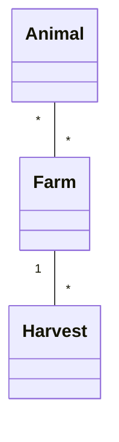

# FarmManagement - Project .NET Framework

- Naam: Matthias Wuyts
- Studentennummer: 0175026-38
- Academiejaar: 25-26
- Klasgroep: ISB204A
- Onderwerp: Animal \* - \* Farm 1 - \* Harvest

## Sprint 1



## Sprint 3

### Beide zoekcriteria ingevuld
```sql
SELECT "a"."Id", "a"."AverageWeight", "a"."Lifespan", "a"."Species", "a"."Type"
FROM "Animals" AS "a"
WHERE "a"."Type" = @__type_0 AND "a"."Lifespan" >= @__minimumLifespan_1
```
### Enkel zoeken op type dier
```sql
SELECT "a"."Id", "a"."AverageWeight", "a"."Lifespan", "a"."Species", "a"."Type"
FROM "Animals" AS "a"
WHERE "a"."Type" = @__type_0
```
### Enkel zoeken op minimum lifespan
```sql
SELECT "a"."Id", "a"."AverageWeight", "a"."Lifespan", "a"."Species", "a"."Type"
FROM "Animals" AS "a"
WHERE "a"."Lifespan" >= @__minimumLifespan_0
```
### Beide zoekcriteria leeg
```sql
SELECT "a"."Id", "a"."AverageWeight", "a"."Lifespan", "a"."Species", "a"."Type"
FROM "Animals" AS "a"
```
