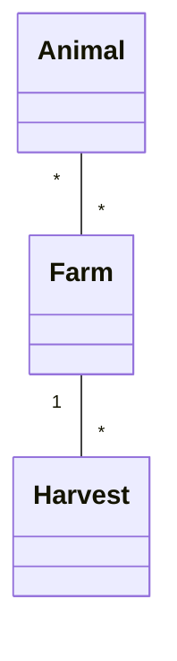
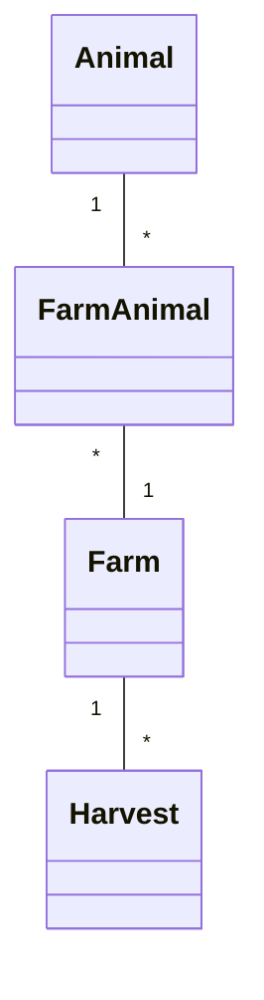

# FarmManagement - Project .NET Framework

- Naam: Matthias Wuyts
- Studentennummer: 0175026-38
- Academiejaar: 25-26
- Klasgroep: ISB204A
- Onderwerp: Animal \* - \* Farm 1 - \* Harvest

## Sprint 1



## Sprint 3

### Beide zoekcriteria ingevuld
```sql
SELECT "a"."Id", "a"."AverageWeight", "a"."Lifespan", "a"."Species", "a"."Type"
FROM "Animals" AS "a"
WHERE "a"."Type" = @__type_0 AND "a"."Lifespan" >= @__minimumLifespan_1
```
### Enkel zoeken op type dier
```sql
SELECT "a"."Id", "a"."AverageWeight", "a"."Lifespan", "a"."Species", "a"."Type"
FROM "Animals" AS "a"
WHERE "a"."Type" = @__type_0
```
### Enkel zoeken op minimum lifespan
```sql
SELECT "a"."Id", "a"."AverageWeight", "a"."Lifespan", "a"."Species", "a"."Type"
FROM "Animals" AS "a"
WHERE "a"."Lifespan" >= @__minimumLifespan_0
```
### Beide zoekcriteria leeg
```sql
SELECT "a"."Id", "a"."AverageWeight", "a"."Lifespan", "a"."Species", "a"."Type"
FROM "Animals" AS "a"
```

## Sprint 4



## Sprint 6

### Nieuwe Harvest
#### Request
```http request
POST https://localhost:7214/api/Harvests
Content-Type: application/json

{
  "cropType": "Corn",
  "quantity": 500.10,
  "harvestDate": "2025-09-01"
}
```
#### Response
```http request
HTTP/2 201 Created
content-type: application/json; charset=utf-8
date: Sat, 20 Dec 2025 21:19:42 GMT
server: Kestrel
location: https://localhost:7214/api/Harvests?id=17
x-http2-stream-id: 3
transfer-encoding: chunked

{
  "id": 17,
  "cropType": "Corn",
  "harvestDate": "2025-09-01",
  "quantity": 500.1,
  "farm": null
}
Response file saved.
> 2025-12-20T221942.201.json

Response code: 201 (Created); Time: 51ms (51 ms); Content length: 83 bytes (83 B)
```


